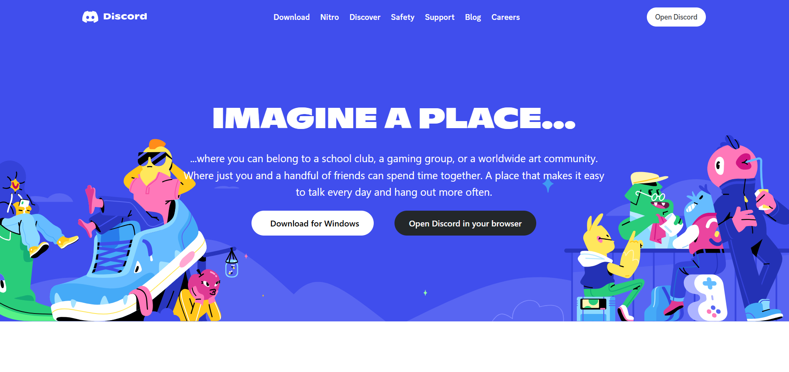
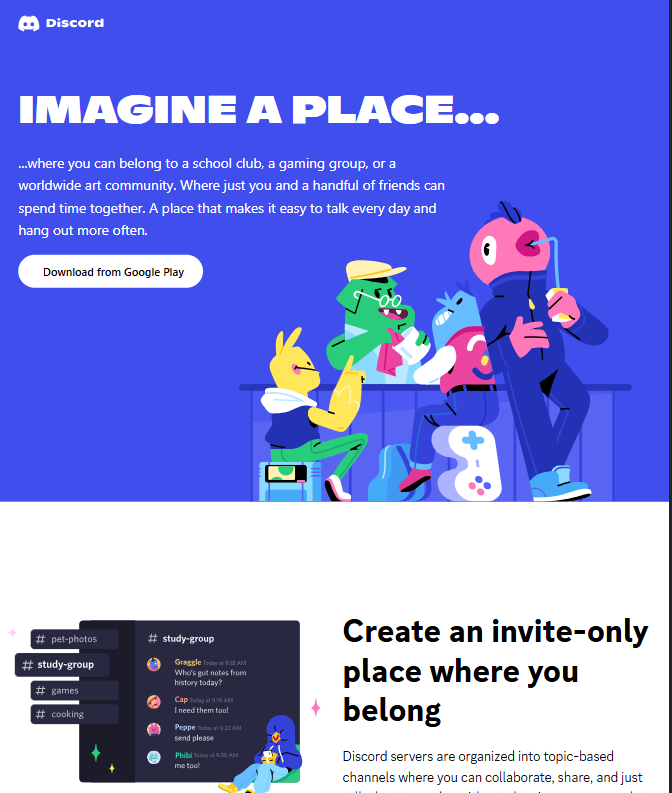
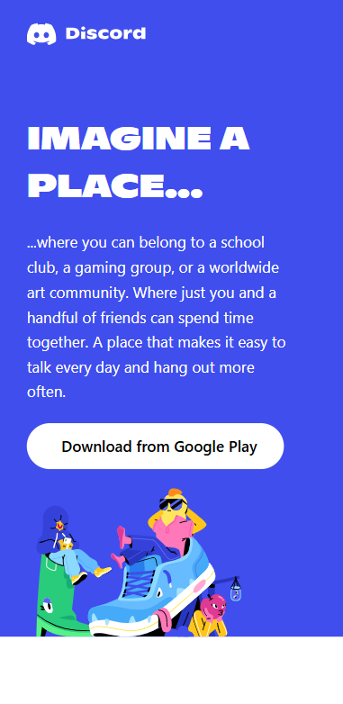

# 📟 Discord Website UI Clone

A responsive and pixel-perfect clone of the official [Discord](https://discord.com) website homepage, built using **HTML** and **Tailwind CSS**.

---

## 📸 Screenshots

### 💻 Desktop View



### 📱 Mobile View




---

## 🛠 Tech Stack

- **HTML5**
- **Tailwind CSS**
- **Responsive Design**
- **Font Awesome (Icons)**

---

## 🧱 Folder Structure

```
discord-ui-clone/
│
├── images/              # All SVG and image assets used
├── main.css             # Tailwind CSS styles
├── index.html           # Main webpage file
├── README.md            # Project documentation
└── favicon.ico          # Favicon
```

---

## 📦 Features

- ✅ Fully responsive layout (mobile, tablet, desktop)
- 🎨 Tailwind CSS utility classes for styling
- ⚡ Smooth section transitions
- 📱 Adaptive buttons for desktop/mobile
- 🧭 Pixel-perfect design matching Discord's original homepage
- 🔗 Semantic HTML for structure and accessibility

---

## 🛠 Setup Instructions

### 1. Clone the repository

```bash
git clone https://github.com/your-username/discord-ui-clone.git
cd discord-ui-clone
```

### 2. Open the project

Open `index.html` in your browser directly or use Live Server in VS Code.

---

## 📂 Deployment

You can deploy this using:

- [GitHub Pages](https://pages.github.com/)
- [Vercel](https://vercel.com/)
- [Netlify](https://netlify.com/)

---

## 🙌 Acknowledgements

- Inspired by the official [Discord.com](https://discord.com) homepage
- Thanks to [Tailwind CSS](https://tailwindcss.com/) for utility-first styling

---

## 🧑‍💻 Author

**Abhishek Mittal**  
GitHub: [@abhishekmittal2306](https://github.com/abhimittal1)  
Feel free to connect and share feedback!

---

## 📄 License

This project is for **educational and practice purposes** only. Not intended for commercial use or redistribution.
